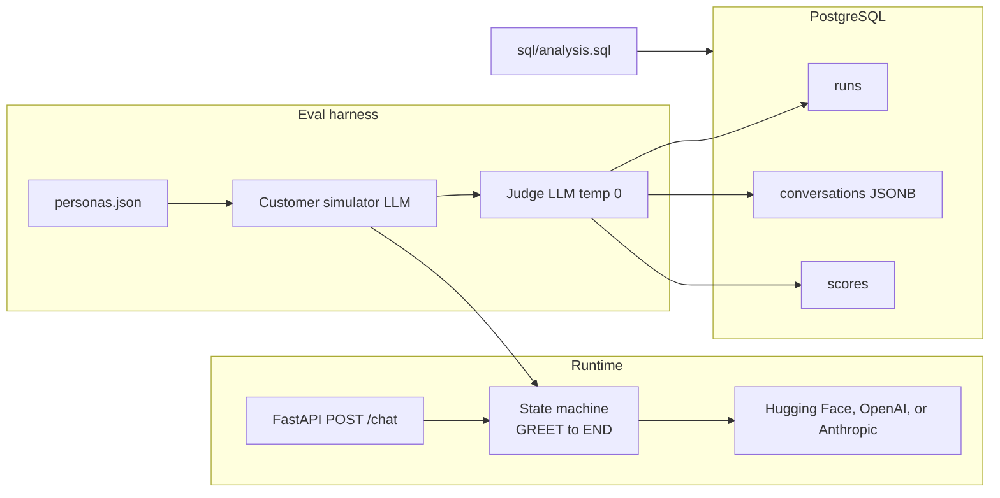

# SalesVoice Eval

🚀 **Live Demo**: [https://salesvoice-eval-production.up.railway.app](https://salesvoice-eval-production.up.railway.app)

LLM-powered loan-lead qualifier ("Priya" at QuickLoan) plus an automated evaluation harness: simulated customers, LLM-as-judge scores, PostgreSQL storage, and SQL comparisons of prompt versions.

## Problem

Voice-style sales agents fail in ways a single demo call will not show: they invent interest rates, miss qualification slots, handle Hinglish poorly, or ignore "I am busy." This project runs the same agent prompt against 30 scripted personas, scores each transcript, and compares `prompts/v1.yaml` vs `prompts/v2.yaml` (v2 adds an objection playbook).

## Project Summary

SalesVoice Eval is an agentic LLM sales workflow for loan-lead qualification. The agent moves through `GREET`, `QUALIFY`, `HANDLE_OBJECTION`, and `CLOSE` stages using persona shaping, role prompting, few-shot examples, and versioned prompt templates. It supports Hugging Face, OpenAI, and Anthropic model providers.

The evaluation harness simulates diverse customers, including Hindi-English code-mixed conversations, and uses an LLM-as-judge to score task success, tone, objection handling, script adherence, and hallucination risk. PostgreSQL stores runs, transcripts, and scores, while SQL reports compare prompt versions and expose recurring failure patterns.

## Architecture



States: `GREET -> QUALIFY -> HANDLE_OBJECTION -> CLOSE -> END`. QUALIFY collects name, city, monthly income, loan amount, and employment type.

## Setup

Python 3.11. PostgreSQL via Docker.

```bash
py -3.11 -m venv .venv
.venv\Scripts\activate
pip install -r requirements.txt
copy .env.example .env
docker compose up -d
```

Set `LLM_PROVIDER` to `huggingface`, `openai`, or `anthropic` and add the matching credential in `.env`.

For Hugging Face, use the router-compatible model and token settings:

```env
LLM_PROVIDER=huggingface
HF_TOKEN=your_huggingface_token
HF_MODEL=Qwen/Qwen2.5-72B-Instruct
```

## How to run

Chat API:

```bash
uvicorn api.main:app --reload --port 8000
```

```bash
curl -X POST http://127.0.0.1:8000/chat -H "Content-Type: application/json" -d "{\"session_id\": \"s1\", \"message\": \"Hello?\"}"
```

Evaluation (writes PostgreSQL):

```bash
python run_eval.py --prompt v1 --personas 30
python run_eval.py --prompt v2 --personas 30
```

No API key (deterministic mock LLMs, still exercises simulator, judge, optional DB):

```bash
python run_eval.py --prompt v1 --personas 30 --mock
python run_eval.py --prompt v2 --personas 30 --mock
```

Use `--skip-db` to print the Rich table without Postgres.

Analytics: `sql/analysis.sql` (average per metric per version, English vs Hinglish task success, five worst conversations, v1 vs v2 delta).

Tests:

```bash
py -3.11 -m pytest -q
```

## Guardrails (in both prompt versions)

- Never promise approval.
- Never invent interest rates or EMI.
- Offer a callback if the customer is busy.
- Max two spoken sentences per turn.

## Results

Filled from a local harness run (`--mock`, 30 personas each). Live API numbers will differ; re-run without `--mock` after setting keys.

| Metric | v1 avg | v2 avg | Delta (v2 - v1) |
| --- | --- | --- | --- |
| task_success | _pending_ | _pending_ | _pending_ |
| script_adherence | _pending_ | _pending_ | _pending_ |
| tone | _pending_ | _pending_ | _pending_ |
| objection_handling | _pending_ | _pending_ | _pending_ |
| hallucination | _pending_ | _pending_ | _pending_ |

Replace the table after the CLI runs in this repo.
